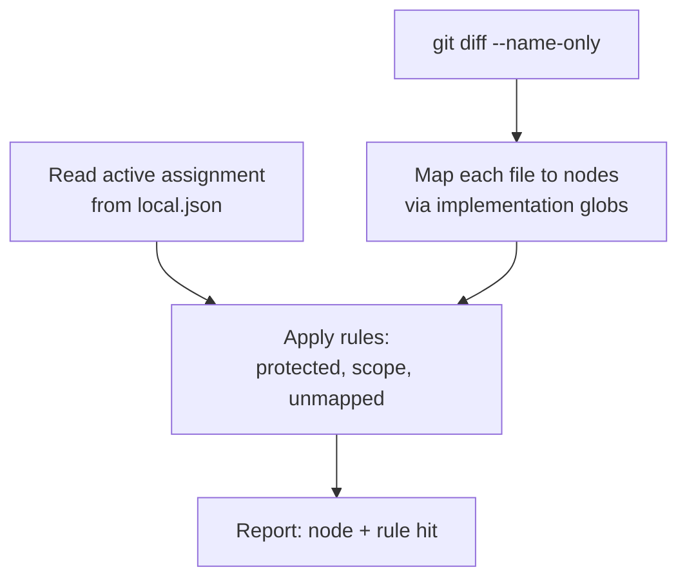

# Architecture — Enforcement Model

## Purpose

Explains how ambit stops an agent from committing outside the boundaries the architect drew:
what `ambit check` does, the exact meaning of `scope` and `protected`, how unmapped files
are treated, and why the enforcement is layered rather than single-point.

This is the product's differentiator. Everything else in ambit is a modelling tool; this is
the part that makes the model consequential.

## Scope

**Covered:** the check pipeline, scope and protected semantics, assignment state, unmapped
file handling, exit code posture, hook installation, and the layered enforcement argument.

**Not covered:** the MCP tool signatures ([`mcp-tools.md`](../contracts/mcp-tools.md)) and
the model format ([`arch-model-format.md`](../contracts/arch-model-format.md)).

## Components

### The check pipeline

1. **Collect the diff.** `git diff --name-only` for the touched file set.
2. **Map files to nodes.** Each node declares `implementation` globs. A file may match more
   than one node; all matches are considered.
3. **Read the assignment.** The active assignment lives in the gitignored `local.json`. Its
   presence or absence changes how unmapped files are treated.
4. **Apply the rules**, below.
5. **Report**, naming both the node and the specific rule that was hit. A violation report
   that does not name the rule leaves the architect guessing at intent.

### `check_scope` over MCP

The same `CheckScope` function, reached over MCP against a caller-supplied file list instead
of a git diff. It is the identical implementation, not a parallel one — if the two could
disagree about whether a file is in scope, the contract is broken.

## Boundaries

### `scope` semantics

`scope` is the list of glob patterns an agent assigned to a node may modify.

**When `scope` is absent or empty, it defaults to the node's `implementation` globs.** Most
nodes want exactly that. Requiring the architect to restate `implementation` as `scope`
before a node can be assigned produces copy-paste, not thought, and a field that is always
a duplicate of another field stops being read.

`scope` is set explicitly only when an agent legitimately needs access beyond the node's own
files — a shared module, a migration directory — or, less commonly, narrower than them.

### `protected` semantics

**`protected` is absolute.** No agent may modify a protected node's files under any
circumstances, including when explicitly assigned to that node. The architect edits those by
hand.

The alternative — allowing a deliberate assignment to override `protected` — was rejected
because it makes the strongest guarantee in the product conditional on a workflow state,
and a conditional guarantee is one the architect has to reason about every time rather than
rely on.

### Unmapped files

A touched file matching no node's `implementation` globs is handled by context:

- **With an assignment active**, an unmapped file falling outside the assigned `scope` is a
  **violation**. This is precisely the case the check exists for: an agent assigned to
  `payments-service` creating `src/notifications/sender.ts` has left its boundary, and the
  fact that no node claims that path does not make it permissible. The model being
  incomplete is not a licence.
- **With no assignment active**, unmapped files are reported as **informational drift**.
  The architect is working by hand, or the model has fallen behind the code. Surfacing it
  keeps model staleness visible without crying wolf at every ordinary edit.

### Assignment state

Assignment lives in `local.json` — gitignored, machine-local, not part of the committed
model.

It is local rather than a committed node field because assignment is a transient fact about
one machine's current working session, not a property of the architecture. Committing it
would put churn in the model's diff history that says nothing about the system being
modelled, and would conflict immediately between two people working from the same repo.

The original spec required the check to know which node an agent was assigned to but
provided no field anywhere to record it. This is where that gap is closed.

### Exit code posture

**Warns by default. Exit code 0.** The check reports; it does not block.

The architect's `git diff` review remains the actual judgment call. The check surfaces what
to look at — it does not replace review, and a tool that blocks commits on a heuristic
mapping of globs to nodes would be wrong often enough to get disabled.

A `--strict` flag is a plausible future addition for anyone who wants the check wired into a
genuinely blocking hook. It is not in v1, and the default must not become blocking without
an ADR.

### Hook installation

Opt-in via `ambit hook install`, which **refuses to overwrite an existing `pre-commit`
hook**. Many repos already run husky or a hook of their own, and an init command that
silently replaces one is doing something hostile with the user's tooling.

`ambit init` prints the suggestion and does nothing else.

## Layered enforcement

Enforcement is layered because no single layer can close the gap, and it is worth being
precise about why.

**Layer 1 — `get_context` framing.** The brief enumerates allowed globs, explicitly names
protected paths and sibling nodes as off-limits rather than omitting them, and states the
escape hatch: stop and report back rather than push through. This reduces the *rate* of
violations.

It cannot do more than that. An agent's native file-editing tools are not gated by MCP at
all — ambit has no ability to intercept them. Good instructions lower frequency; they do not
close the gap, and any design that relies on them closing it is relying on an agent's
compliance for a safety property.

**Layer 2 — `check_scope`.** Voluntary, mid-task, cheap. Converts end-of-task failure into
mid-task correction for any agent that calls it. Still voluntary, so still not a guarantee.

**Layer 3 — `ambit check`.** The mandatory backstop. It runs against the actual git diff,
so it catches everything regardless of agent behaviour, agent compliance, or whether the
agent used MCP at all.

**Layer 3 stays required even as layers 1 and 2 reduce how often it fires.** The tempting
mistake, once the brief is well-tuned and violations become rare, is to treat the backstop
as redundant. It is not: its value is that it does not depend on the agent, and rarity of
firing is evidence the other layers work, not evidence the backstop is unnecessary.

## Invariants

1. **`ambit check` and `check_scope` share one implementation.** They cannot disagree.
2. **Empty or absent `scope` means `implementation`.** Never "nothing permitted".
3. **`protected` overrides assignment**, always.
4. **Violation reports name both the node and the rule hit.**
5. **Exit code is 0 by default.** Changing the default to blocking requires an ADR.
6. **Assignment is never committed.**
7. **`ambit check` verifies gitignore effectiveness at runtime** via `git check-ignore`,
   warning loudly if `local.json`, `.arch/.cache/`, or `.arch/.proposals/` are not actually
   ignored.
8. **The backstop is mandatory** regardless of how well the other layers perform.

## Non-Goals

- **A policy language.** No expression syntax, no custom rule types, no conditions. Keep
  this dumb — the differentiation is the local, offline, default-on posture, not rule
  sophistication. This is the single easiest place in the product to accidentally start
  competing on a feature list that a funded team will win.
- **Blocking by default.** Review is the judgment call.
- **CI enforcement.** Local and pre-accept only; CI is a team-tier concern.
- **Per-agent roles or scope-expansion requests.** Deferred with intent; `protected` plus
  `scope` is the entire governance model in v1.
- **Intercepting agent file edits.** Not possible, and any design premising a guarantee on
  it is wrong.
- **Detecting semantic violations.** The check maps paths to globs. An agent that writes
  something architecturally wrong *inside* its own scope is caught by the architect's
  review, not by this tool.

## References

- Canonical spec: [`docs/planning/spec-v1.md`](../planning/spec-v1.md) Section 10
- ADR: [`docs/adr/0002-agent-interface-and-review-gate.md`](../adr/0002-agent-interface-and-review-gate.md)
- Contracts: [`mcp-tools.md`](../contracts/mcp-tools.md),
  [`arch-model-format.md`](../contracts/arch-model-format.md)
- System shape: [`system-overview.md`](system-overview.md)
