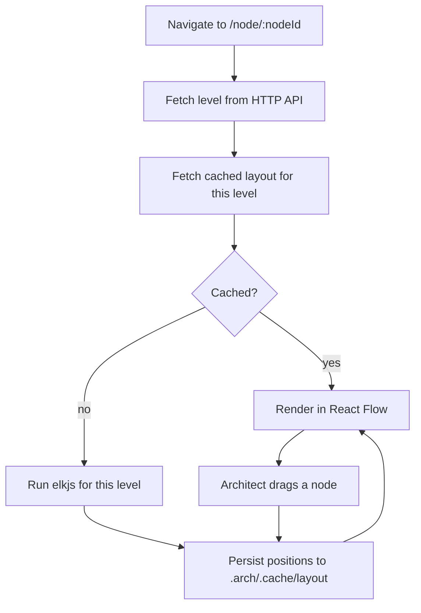

# Architecture — Frontend

## Purpose

Explains the shape of the ambit SPA: how drill-down navigation works, why the canvas is fed
one level at a time, how layout is computed and cached, and how the proposal review surface
fits alongside the canvas.

## Scope

**Covered:** the routing model, the scoped-query rendering strategy, layout and caching,
live updates, the inspector and review surfaces, and the constraints the static-export
posture imposes.

**Not covered:** the HTTP contract ([`local-http-api.md`](../contracts/local-http-api.md)),
the refactor inventory ([`frontend-refactor.md`](../planning/stages/03-architect-canvas/frontend-refactor.md)), and the
platform choice rationale ([ADR-0004](../adr/0004-frontend-platform.md)).

## Components

### Platform

React Router v8 in SPA mode (`ssr: false`), Vite, Tailwind v4, React Flow
(`@xyflow/react` v12), elkjs. `react-router build` emits a static client bundle, `go:embed`-ed
into the Go binary.

**No loaders, actions, or server-side rendering may do real work.** All logic lives in Go,
and the bundle is served by a Go binary that knows nothing about React Router. This is a
standing discipline, not a one-time setup step: loaders and actions are React Router's
idiomatic path and will be reintroduced by habit unless the constraint stays written down.

### Routing and drill-down

The current drill-down level is a real route:

- `/` — the root model: nodes with no `parent_id`.
- `/node/:nodeId` — that node's direct children.

Browser back and forward work, levels are deep-linkable, and the route parameter is the same
key the layout cache is stored under. That last point is a small but genuine convenience:
the router hands over the cache key for free rather than it being derived from component
state.

### Canvas rendering

**React Flow is fed only the current level's nodes and edges.** The client requests a level
from the HTTP API and renders exactly what comes back.

It never fetches the whole graph and filters client-side. This is the one genuinely
performance-relevant decision in the architecture — everything else at this scale is
comfortably fast by default — and it is a decision that has to be actively maintained,
because "fetch everything once and filter" is the easier thing to write and only starts
hurting on a model large enough to matter.

A relationship whose other endpoint sits outside the current level is rendered as a
boundary-crossing indicator on the node that is present, not as an edge to a node that is
not on screen.

### Layout

elkjs, computed in the browser, **per drill-down level** — a node's direct children plus the
relationships among them. Never the whole graph flattened.

elk rather than dagre because elk supports hierarchical and compound nodes natively, which
maps directly onto a structure where a node at one level *is* a nested graph at the next.
Dagre treats layout as a flat DAG and would need workarounds to fake that nesting.

Layout is recomputed **only on structural change** — a node added, removed, or reparented —
never on every load. Cached positions are read back on navigation, so the canvas looks the
same when the architect returns to a level instead of jittering into a new arrangement.

Manual drag-to-reposition writes into the same cache. From the model's point of view there
is no difference between a position elk computed and one the architect dragged: both are
presentation state, and neither is architecture.

**Layout never touches canonical files.** The canonical model holds no coordinates by
design; see [ADR-0001](../adr/0001-canonical-model-storage.md).

### Live updates

A single SSE connection to `/events`. Three event kinds matter to the client:

- **Model changed** — refetch the affected nodes. Fires for UI writes, MCP status writes,
  and the architect hand-editing a file in their editor.
- **Proposals changed** — refresh the review surface. This is what makes an agent's staged
  work appear without a refresh, which is the difference between the review gate being part
  of the workflow and being something the architect has to remember to go looking for.
- **Integrity changed** — update the warnings surface.

The stream is one-way. The client sends nothing over it; it has the HTTP API for that.

### Node inspector

Rebuilt around the ambit node model: `name`, `type` (free-form text, not a select — there is
no enum), `status`, `implementation` globs, `scope` globs, and the `protected` toggle, plus
the markdown spec.

Two things deserve deliberate treatment in the UI rather than being rendered as plain
fields:

- **Empty `scope` must visibly communicate that it defaults to `implementation`**, not read
  as "no access". A blank field that silently means something specific is a field that gets
  misread.
- **`protected` is absolute.** The toggle should make clear it applies regardless of
  assignment, because "protected" reads as conditional to anyone who has not read the
  enforcement model.

### Proposal review surface

Lists pending proposals with their operations, each rendered as a diff between current and
proposed state.

- **Per-node accept and reject**, with accept-all and reject-all shortcuts.
- **Stale operations are visually distinct** and require explicit confirmation. Accept-all
  **skips** them and says which were skipped — it must never sweep a stale operation
  through, since the whole point is that the architect's newer edit is being written over.
- A `seed_model` proposal can carry thirty operations. The surface needs its summary and
  per-node granularity to be usable at that size; a wall of thirty undifferentiated diffs is
  a gate nobody reads.

## Boundaries

- **The frontend owns presentation only.** Validation, mutation, and enforcement all live in
  Go. The client may render a constraint but never enforces one.
- **The client never derives the model.** Levels, relationships, and staleness are all
  computed server-side and fetched. Staleness in particular is computed at read time by the
  server, not inferred in the browser.
- **Layout is the one thing the client computes**, because elkjs is a JavaScript library.
  The Go side owns the cache; the browser owns the computation. A consequence worth knowing:
  layout cannot be computed headlessly by the CLI.
- **The bundle and the binary ship together.** They are compiled into one artifact, so there
  is no version skew between the SPA and the API — and equally, no independent release of
  either.

## Invariants

1. **The canvas is fed one drill-down level.** Never the whole graph filtered client-side.
2. **No loader, action, or server component does real work.**
3. **Layout writes never touch canonical files.**
4. **Layout recomputes only on structural change.**
5. **Drill-down level is reflected in the URL.**
6. **The SSE stream is receive-only.**
7. **Stale proposal operations cannot be accepted via accept-all.**
8. **Empty `scope` is displayed as defaulting to `implementation`**, never as empty
   permission.
9. **An unknown node `type` renders a generic fallback.** Never a crash, never a warning —
   free-form types mean unrecognised is the normal case, not the exceptional one.

## Non-Goals

- **Server-side rendering of any kind.** The static export must stay straightforward.
- **A conversational or chat UI.** ambit has no LLM client; generation happens in the
  architect's harness. This supersedes the original spec's deferral of merely the multi-turn
  version — there is no single-turn instruction box either.
- **Client-side graph algorithms beyond layout.** Traversal, filtering, and integrity
  checking belong in Go.
- **Offline-first browser storage.** The Go process is always local and always the source of
  truth; caching the model in the browser would create a second one.
- **Component or end-to-end test coverage in v1.** Vitest covers pure logic only — proposal
  diffing, scope glob matching, layout cache keying — while the UI shape is still moving.
  See [decision note 0004](../decisions/0004-testing-strategy.md).
- **Multiplayer, presence, or cursors.** Single user, single machine.

## References

- ADR: [`docs/adr/0004-frontend-platform.md`](../adr/0004-frontend-platform.md)
- Canonical spec: [`docs/planning/spec-v1.md`](../planning/spec-v1.md) Sections 4 and 5
- Contract: [`docs/contracts/local-http-api.md`](../contracts/local-http-api.md)
- Refactor plan: [`docs/planning/stages/03-architect-canvas/frontend-refactor.md`](../planning/stages/03-architect-canvas/frontend-refactor.md)
