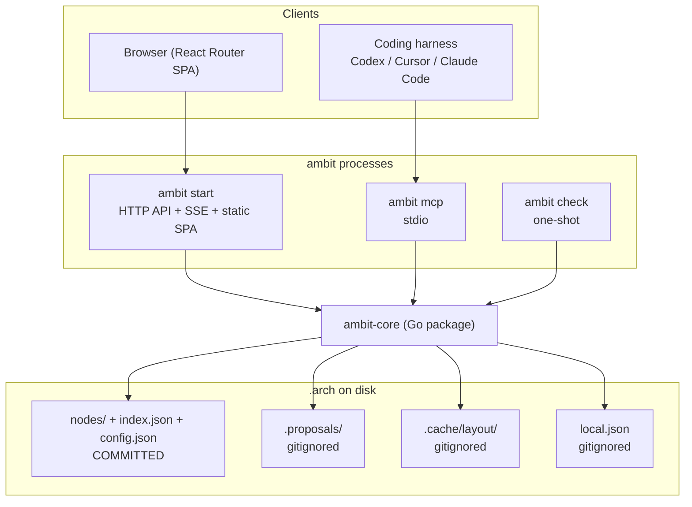

# Architecture — System Overview

## Purpose

Explains the shape of ambit as a running system: what the components are, who owns which
responsibility, where the seams sit, and what must remain true as it grows. This is the
orientation document — read it first, then the specific contracts.

## Scope

**Covered:** component responsibilities, the two front doors and why they are independent,
the data flow from transcript to merged code, and the system-wide invariants.

**Not covered:** the on-disk format ([`arch-model-format.md`](../contracts/arch-model-format.md)),
enforcement semantics ([`enforcement-model.md`](enforcement-model.md)), and frontend
internals ([`frontend.md`](frontend.md)).

## Components

### `ambit-core` (Go package)

The whole of the domain logic:

- Schema read and write for `.arch`.
- The in-memory graph index: `map[NodeID]*Node` keyed by ID, `parent_id` for hierarchy, and
  a separate adjacency index for cross-cutting relationships. The separation is structural,
  not stylistic — relationships jump across the tree and would corrupt a structure that
  assumed one.
- Graph mutations with validation: cycle prevention, reference integrity, ID derivation.
- Layout cache management (storage and invalidation; the computation itself is elkjs in the
  browser).
- Proposal staging, staleness computation, and atomic apply.
- Git diff to node mapping, and the scope/protected check.

### Local HTTP API — `ambit start`

Serves the `go:embed`-ed SPA, exposes graph CRUD and drill-down queries, persists layout,
drives proposal review, and pushes change notifications over SSE. Localhost only, no auth.
Contract: [`local-http-api.md`](../contracts/local-http-api.md).

### MCP server — `ambit mcp`

Eight tools over stdio, spawned by the harness. Five authoring tools write to staging; three
read-and-report tools serve an assigned agent. Contract:
[`mcp-tools.md`](../contracts/mcp-tools.md).

### Enforcement — `ambit check`

One-shot. Maps the current git diff to nodes and reports violations. Contract and semantics:
[`enforcement-model.md`](enforcement-model.md).

### Frontend — React Router SPA

Static, client-side only, embedded in the binary. React Flow for the canvas, elkjs for
layout. Details: [`frontend.md`](frontend.md).

## Boundaries

### The one rule

**All graph mutation logic lives in `ambit-core`, called by both front doors.** The UI
editing a node and an agent creating a node over MCP traverse the identical validation and
file-write path.

This is the load-bearing seam in the whole design. Two implementations of "what a valid
mutation is" would drift, and the drift would show up as an agent being permitted to write
something the UI would have rejected — a security-shaped bug in a product whose entire value
is that the boundaries hold.

### The staging asymmetry

The two front doors are *not* symmetric in one specific respect, and the asymmetry is
deliberate:

- **UI structural writes are direct.** The architect is present; there is nothing to review.
- **MCP structural writes are staged.** The architect is not present at the moment of
  writing, so the gate must be explicit.
- **`update_node_status` over MCP is direct**, a narrow exception. It writes one enumerated
  field, cannot restructure anything, and staging it would leave `status` not reflecting
  reality until the architect next opened the UI.

Note that the asymmetry is in *where the write lands*, not in *how it is validated*. Both
paths validate identically in `ambit-core`. Staging is a delay, not a bypass.

### Process independence

`ambit start` and `ambit mcp` are separate OS processes with separate lifecycles, each with
its own in-memory index, converging through the filesystem and file watching. MCP does not
require the UI server and does not proxy through it.

This is driven by ownership: the harness spawns and kills the MCP process on its own
schedule, and the architect starts and stops the UI on theirs. Coupling them would mean MCP
failing whenever a browser window was closed.

The cost is real and worth naming: two in-memory copies of the same model, converging
eventually rather than authoritatively, with no cross-process write lock in v1. Writes are
small, scoped to distinct files, and infrequent, which is why this is acceptable rather than
solved. Recorded as a known thin spot in
[ADR-0003](../adr/0003-runtime-and-distribution.md).

### Canonical versus derived

Committed and canonical: `nodes/`, `index.json`, `config.json`.

Gitignored and disposable: `.cache/` (rebuildable), `.proposals/` (unreviewed),
`local.json` (machine-specific).

Nothing derived is ever a source of truth, and nothing gitignored may be committed. The
second half of that is verified at runtime, not merely written into `.gitignore` once.

## Data flow

### Authoring

1. The architect gives their harness a client transcript.
2. The harness generates a model and calls `seed_model`.
3. `ambit mcp` writes a proposal to `.arch/.proposals/`, and returns a proposal ID with an
   explicit statement that nothing has been applied.
4. `ambit start` sees the new directory via `fsnotify` and pushes a proposals-changed event
   over SSE.
5. The review panel appears in the architect's browser without a refresh.
6. The architect accepts per node. Accepted operations move atomically into `.arch/nodes/`.
7. The architect commits. The diff is per-node and readable.

### Assignment and build

1. The architect assigns a node. The assignment is recorded in the gitignored `local.json`.
2. The coding agent calls `get_context(node_id)` and receives an imperative brief naming its
   allowed globs and explicitly naming what is off-limits.
3. The agent builds, calling `check_scope` periodically for early feedback.
4. The agent calls `update_node_status`, which writes directly.
5. The architect runs `ambit check` (or it runs as an opt-in pre-commit hook), which maps the
   diff to nodes and reports anything outside the assigned scope or touching a protected
   node.
6. The architect reviews `git diff` — the actual judgment call — and merges.

## Invariants

1. **All mutations go through `ambit-core`.** No front door implements its own write path.
2. **MCP structural writes never reach `.arch/nodes/` directly.**
3. **Derived data is never a source of truth**, and gitignored paths are never committed —
   verified at runtime by `git check-ignore` on every `ambit start` and `ambit check`.
4. **The canonical model holds no coordinates.**
5. **ambit makes no outbound model-provider calls.** There is no LLM client, no API key, and
   no provider configuration anywhere in the system.
6. **`check_scope` and `ambit check` share one implementation** and cannot disagree.
7. **The HTTP server binds to localhost only.**
8. **Enforcement is layered, and the backstop is mandatory.** `get_context` framing and
   voluntary `check_scope` calls reduce how often `ambit check` fires; neither replaces it,
   because neither can constrain an agent's native file-editing tools.
9. **The frontend does no server-side work.** All logic is in Go.

## Non-Goals

- **Not a collaboration tool.** No accounts, no sync, no multiplayer, no billing. That is
  precisely what the local-first posture is positioned against.
- **Not a policy engine.** The check stays dumb: `protected` and `scope`, no policy
  language, no rule taxonomy. The differentiation is that it runs locally and by default,
  not that its rules are clever.
- **Not an LLM product.** ambit hosts no model client. Generation belongs to the harness the
  architect already uses.
- **Not a codebase scanner.** Bootstrapping a model from an existing repository is a
  plausible v2 for brownfield engagements, deliberately deferred.
- **Not an orchestrator.** One agent, one assignment, one reviewer, at a time.
- **Not CI infrastructure.** `ambit check` runs locally, pre-accept. CI enforcement is a
  team-tier concern.
- **Not scalable to a large organisation's estate.** The in-memory index and per-file
  storage assume dozens to low hundreds of nodes for a single engagement. This is a
  deliberate ceiling, not an oversight.

## References

- Canonical spec: [`docs/planning/spec-v1.md`](../planning/spec-v1.md)
- ADRs: [0001](../adr/0001-canonical-model-storage.md),
  [0002](../adr/0002-agent-interface-and-review-gate.md),
  [0003](../adr/0003-runtime-and-distribution.md),
  [0004](../adr/0004-frontend-platform.md)
- Contracts: [arch model format](../contracts/arch-model-format.md),
  [MCP tools](../contracts/mcp-tools.md),
  [proposals](../contracts/proposals.md),
  [local HTTP API](../contracts/local-http-api.md)
