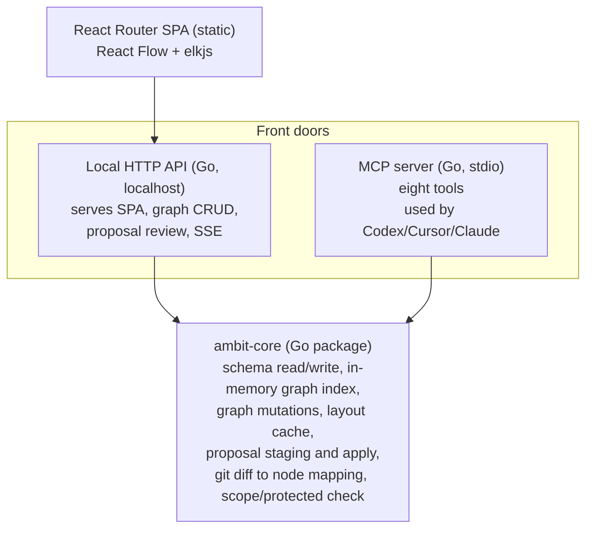

# ambit — v1 Build Spec (canonical)

## Status

Canonical. Supersedes [`docs/archive/spec-v0-original.md`](../archive/spec-v0-original.md) in full.

## Date

2026-09-27

---

## The one sentence

A local-first, Git-backed architecture model that a solutions architect builds from a client
transcript and hands to coding agents as a source of truth — with a simple local check that
stops an agent from committing outside the boundaries the architect drew.

## Deltas from the original spec

Every item here contradicts the archived spec. They are listed up front so nothing below
reads as a quiet revision.

1. **The product is `ambit`**, not `archmap`. The CLI is `ambit init | start | mcp | check`,
   plus an opt-in `ambit hook install`. The on-disk directory remains `.arch/` — the name
   describes what it holds, not who wrote it, and changing it buys nothing.
2. **The frontend is a React Router SPA**, not Next.js. See
   [ADR-0004](../adr/0004-frontend-platform.md).
3. **Node types are free-form strings**, not an AWS-native taxonomy. This is not a
   cosmetic change: it deletes the original spec's stated secondary wedge. See
   [decision note 0002](../decisions/0002-node-type-taxonomy.md) and
   [decision note 0003](../decisions/0003-positioning.md).
4. **ambit contains no LLM client at all.** The local LLM proxy, the Anthropic dependency,
   the API key in `local.json`, and the single-turn instruction/regenerate UI are all cut.
   Model authoring happens inside whichever coding harness the architect already uses
   (Codex, Cursor, Claude Code) by way of MCP. See
   [ADR-0002](../adr/0002-agent-interface-and-review-gate.md).
5. **The MCP surface is eight tools, not three.** MCP is now the primary authoring
   surface rather than a read-and-report sidecar.
6. **A staging layer exists that the original spec has no concept of.** Structural
   mutations arriving over MCP are written to a gitignored `.arch/.proposals/`, not
   directly into the canonical model. The UI renders them as a diff and the architect
   accepts or rejects per node.
7. **Node prose lives in a sibling `.arch/nodes/<id>.md`**, not an inline `markdown_spec`
   JSON string.
8. **Assignment is local, uncommitted state**, held in `local.json`. The original spec
   required `check` to know which node an agent was assigned to but provided no field to
   record it.
9. **The `.gitignore` release gate survives, on different grounds.** There is no longer a
   secret to leak, but `local.json`, `.arch/.cache/`, and `.arch/.proposals/` must still
   never enter a commit.

---

## Positioning

IcePanel already does hosted C4 modelling, drill-down, current/future forking, and an MCP
server that answers questions about the model and syncs objects with code. Competing on
that feature list is a losing posture — a funded team will out-execute feature-for-feature.

The wedge is posture, not features: local-first, zero-account, offline by default, and a
check that can actually stop an agent from committing outside a declared boundary — versus
a hosted reference and sync layer. That posture implies a business model which is
structurally awkward for a SaaS collaboration tool to adopt casually.

The original spec carried a secondary, vertical wedge: AWS-native node types for solo AWS
solutions architects. That is gone. Node types are free-form, ambit is domain-agnostic,
and there is no vertical claim in v1. Positioning now rests entirely on posture. The
reasoning and the cost of this are recorded in
[decision note 0003](../decisions/0003-positioning.md).

Keep the enforcement check dumb. The differentiation is that it runs locally and by
default, not that its rules are clever.

## 1. Core loop

```mermaid
flowchart LR
    transcript["Client transcript"]
    harnessSeed["Harness seeds model via MCP"]
    proposal["Proposal staged"]
    review["Architect reviews diff, accepts per node"]
    canonical[".arch committed"]
    assign["Architect assigns node"]
    brief["Agent calls get_context"]
    build["Agent builds"]
    check["ambit check flags out-of-scope files"]
    status["Agent calls update_node_status"]
    merge["Architect reviews git diff, merges"]

    transcript --> harnessSeed --> proposal --> review --> canonical
    canonical --> assign --> brief --> build --> check --> status --> merge
```



The product principle is unchanged from the original spec and survives every scoping pass:
**the human is in the seat driving the agents, not the agents driving the human.** Every
interaction point above is propose, then accept/reject/edit, then commit.

What changed is where that gate physically lives. In the original spec the architect typed
an instruction into the UI and reviewed the result in the same window, so the accept/reject
step was trivially co-located with the human. Now an agent in a separate terminal can
author the model, and the human is not present at the moment of writing. The staging layer
in Section 9 exists purely to put the gate back.

## 2. Canonical model — storage

Git-committed, canonical:

```
.arch/
├── nodes/
│   ├── <node-id>.json       # structured fields, one file per node
│   ├── <node-id>.md         # prose spec for that node
│   └── ...
├── index.json               # schema_version + hierarchy + cross-cutting relationships
├── config.json              # non-secret, committed config
└── local.json               # GITIGNORED — machine-local state (active assignment, UI prefs)
```

**One file per node, not a single `schema.json`.** A single large JSON file means every
node edit touches the whole file, git diffs stop being scoped to what actually changed, and
merge friction grows with graph depth. Per-node files keep diffs scoped to the node that
actually changed, which is also closer to how a PR review should look.

**Prose is a sibling `.md` file, not an inline field.** The original spec put
`markdown_spec` inside the node JSON. That would store a node's entire written
specification as a single escaped string on one line — unreadable in a diff, painful to
edit by hand, and directly at odds with the per-node-file rationale above. Splitting the
structured fields from the prose preserves the point of the split. The full format is in
[`docs/contracts/arch-model-format.md`](../contracts/arch-model-format.md).

**Node fields** (in the `.json`): `id`, `name`, `type`, `parent_id`, `implementation`
(glob list), `protected` (bool), `scope` (glob list an assigned agent may touch), `status`.
Prose lives in the sibling `.md`.

**Node IDs are human-readable slugs**, derived from the node's name at creation, immutable
afterwards, with a numeric suffix on collision (`orders-service`, `orders-service-2`).
These become filenames and appear in `parent_id`, in relationships, and in every MCP call,
so readability pays off constantly. Immutability matters more than matching a later rename.

**Node `type` is a free-form string.** No registry, no enum, no validation. The UI picks an
icon on a best-effort match and falls back to a generic shape for anything it does not
recognise. An unknown type is never an error.

**No coordinates in the canonical model.** Visual layout is a presentation concern, not part
of the model's meaning. The schema documentation carries an explicit note saying so, to stop
a future reader — or an agent without this context — from "correcting" the omission.
Positions live in `.arch/.cache/layout/`.

**`schema_version` lives once, in `index.json`.** Node files inherit it. The format is
designed to accept additive change, and reserved-but-unbuilt fields (`observed_implementation`,
extended `agent_authority` beyond `protected`/`scope`) are documented as optional so the
shape need not change later. No v1 code is written against them.

### The `.gitignore` release gate

There is no API key in ambit any more, so the original "leaked key" framing no longer
applies. The gate survives for a different reason: `local.json` holds the active assignment
and machine-local state, `.arch/.cache/` holds derived layout, and `.arch/.proposals/`
holds unreviewed agent output. Committing any of them pollutes the canonical model with
state that is either machine-specific or explicitly unapproved — and `.proposals/` in
particular would mean unreviewed agent-authored content landing in git under the guise of
the model, which is exactly the failure the review gate exists to prevent.

Treat this as a v1 release gate, not a nice-to-have:

- `ambit init` must create `.gitignore` if missing and append the entries idempotently —
  check for an existing entry before appending, so re-running `init` is safe.
- Injection alone is insufficient. `ambit start` and `ambit check` must verify at runtime,
  via `git check-ignore`, that the entries are actually in effect, and warn loudly if not.
  This covers `init` running before `git init`, a pre-existing `.gitignore` merging oddly,
  or an entry being edited out later.
- **The gating test is an integration test, not a string assertion.** Asserting on
  `.gitignore`'s contents does not test the failure mode that matters. The gating test runs
  the full `init` flow in a temp directory, actually runs `git init`, actually runs
  `git add -A`, and asserts that `local.json`, `.arch/.cache/`, and `.arch/.proposals/`
  do not appear in `git status --porcelain`. Build order step 1 is incomplete until this
  passes.

## 3. Derived / disposable layer

Everything below is gitignored, rebuildable from the canonical files, and never a source of
truth:

```
.arch/
├── .cache/
│   └── layout/<node-id>.json    # cached elkjs positions, per drill-down level
└── .proposals/
    └── <proposal-id>/           # staged, unreviewed mutations (Section 9)
```

**In-memory graph index (Go).** `map[NodeID]*Node` keyed by ID, `parent_id` for hierarchy,
and a *separate* adjacency index for cross-cutting relationships — these are not tree edges,
since `orders → payments` jumps across the hierarchy. Built once at startup from
`.arch/nodes/*.json`, held in memory, rebuilt on file-watch change.

No SQLite, and no database of any kind. This graph is dozens to low hundreds of nodes for a
single client engagement. A flat in-memory map is O(1) at that scale, and a database would
solve a scale problem this project does not have while adding a migration story it does not
want.

**Layout cache.** elkjs runs once per drill-down level and the resulting positions are
persisted to `.arch/.cache/layout/`. It is invalidated and recomputed only on structural
change — a node added, removed, or reparented — not on every load. Manual drag-to-reposition
in the UI writes into this same cache. The effect is a canvas that stays visually stable
between sessions while the canonical model remains coordinate-free.

## 4. Layout algorithm

elkjs, not dagre. Elk has native support for hierarchical and compound nodes — a node that
contains its own subgraph — which maps directly onto the drill-down structure, where a node
at one level *is* a nested graph at the next. Dagre treats layout as a flat DAG and would
need workarounds to fake compound nesting.

Layout is computed per drill-down level: a node's direct children plus the relationships
among them. Never the whole graph flattened at once. This keeps both the computation and
the resulting cache scoped to what is actually on screen.

## 5. Frontend rendering strategy

React Flow is fed only the current drill-down level's nodes and edges — the result of a
scoped query (`GetChildren(nodeID)` plus the relationships among those children) against
the in-memory index. Never a client-side filter over the entire graph.

This is the one genuinely performance-relevant decision in the architecture. Everything
else at this scale is comfortably fast by default.

The current drill-down level is a real route, `/node/:nodeId`, with the root model at `/`.
Browser back and forward work, levels are deep-linkable, and the route parameter is the
same key the layout cache is stored under.

## 6. Component architecture



**One rule: all graph mutation logic lives in `ambit-core`, called by both front doors.**
The UI editing a node and an agent creating a node over MCP go through the identical
validation and file-write path. There is never a second implementation of "what a valid
mutation is."

The two front doors are **independent processes**. `ambit mcp` is spawned by the harness over
stdio and reads and writes `.arch` directly; it does not require `ambit start` to be
running and does not proxy through it. Each process watches the filesystem for changes made
by the other. This matters because the harness owns the MCP process lifecycle, and coupling
it to a separately-launched UI server would make MCP fail whenever the architect closed a
browser window.

## 7. Distribution

- `npx ambit` is a thin shim that downloads and runs a platform-specific Go binary. It is
  not a Node runtime dependency.
- `react-router build` produces a static client bundle (`build/client`), `go:embed`-ed
  directly into the Go binary.
- `ambit start` is a single binary: it serves the static frontend and runs the local HTTP
  API. `ambit mcp` is a separate subcommand for a separate process. No Node runtime is
  required on the user's machine at all.
- Practical consequence for the frontend: it must stay a fully client-side SPA. No loaders,
  actions, or server-side rendering doing real work — that logic lives in Go.
  [`frontend/react-router.config.ts`](../../frontend/react-router.config.ts) already sets
  `ssr: false`, so this is the existing posture rather than a migration.

## 8. MCP interface

Eight tools, all thin wrappers over `ambit-core`. Full signatures and semantics are in
[`docs/contracts/mcp-tools.md`](../contracts/mcp-tools.md).

**Authoring (staged — writes go to `.arch/.proposals/`, never straight to the model):**

- `seed_model(transcript)` — propose a top-level model from a client transcript.
- `create_node(...)`, `update_node(...)`, `delete_node(...)` — single-node structural changes.
- `set_relationship(...)` — create or modify a cross-cutting relationship.

**Read and report (direct):**

- `get_context(node_id)` — returns the node's scope, interfaces, constraints, and spec as a
  ready-to-use task brief, not a raw data dump. This is what an assigned coding agent
  receives.

  Prompt engineering here matters and needs real iteration, not a one-shot template.
  Explicitly enumerate the allowed paths from `scope`, and explicitly *name* protected paths
  and sibling nodes as off-limits rather than simply omitting them. Include sibling nodes'
  interfaces without their implementation detail, so the agent can call into a neighbouring
  system correctly without reaching inside it. Frame it imperatively: the agent may only
  modify files matching the given globs, and if the task requires more, it must stop and
  report back rather than push through.

- `check_scope(node_id, files)` — exposes the same `CheckScope` logic that `ambit check`
  runs against a git diff, callable mid-task before an agent has gone too far. It costs
  almost nothing to build, being the same underlying function reached over MCP instead of
  from a diff, and gives a compliant agent fast feedback after touching a few files rather
  than only at the end. The `get_context` brief instructs the agent to call it periodically
  and before finishing.

- `update_node_status(node_id, status)` — one field write, called by the agent on
  completion. **This writes directly, bypassing staging.** Routing it through review would
  mean the architect has to click accept for a status transition, which is friction with no
  corresponding risk: it is a single enumerated field, it cannot restructure the model, and
  it is trivially revertable.

**Enforcement is layered, not single-point.** `get_context` framing reduces the *rate* of
violations but cannot constrain an agent's native file-editing tools, which are not gated by
MCP at all — good instructions lower frequency, they do not close the gap. `check_scope`
catches problems early for agents that call it voluntarily. `ambit check` (Section 10) is
the mandatory backstop that catches everything regardless of agent behaviour, and stays
required even as the other two reduce how often it fires.

**Transport is stdio**, matching how Codex, Cursor, and Claude Code expect to invoke local
MCP servers — a direct command, not a running HTTP server. Run as the `ambit mcp` subcommand.

## 9. Local HTTP API and the review gate

The local HTTP API is a thin REST/JSON wrapper over `ambit-core` for the frontend: graph
CRUD, drill-down navigation queries, proposal review, and a server-sent events stream. Full
surface in [`docs/contracts/local-http-api.md`](../contracts/local-http-api.md).

**There is no LLM proxy endpoint and no API key.** ambit does not talk to a model provider.
The architect's existing harness does the generation and calls ambit's MCP tools with the
result. This removes an entire dependency, a secret-handling surface, a billing
relationship, and a provider-compatibility burden from the product. It also means ambit
works with whatever model the architect is already paying for.

### Staging and review

Because an agent can now author the model from a different window, the accept/reject gate
has to be made explicit rather than being an artifact of the UI's layout.

- Structural mutations arriving over MCP are written to `.arch/.proposals/<proposal-id>/`,
  containing the would-be node files plus a `manifest.json` listing the operations and the
  base content hash each was computed against. Nothing enters `.arch/nodes/` unaccepted.
- The Go server watches the filesystem and pushes changes to the browser over SSE on a
  single one-way `/events` stream. SSE rather than WebSocket because the traffic is
  one-directional, it reconnects for free, and it is materially less to implement and debug.
- The UI renders each proposal as a diff against current state. The architect accepts or
  rejects **per node**, with accept-all and reject-all shortcuts. Per-node granularity
  matters because `seed_model` on a real transcript can produce thirty nodes at once, and an
  all-or-nothing gate on thirty nodes is a gate nobody uses carefully.
- **Staleness is tracked.** If the architect edits a node in the UI after an agent staged a
  proposal touching it, the manifest's recorded content hash no longer matches. The UI flags
  those operations as stale and requires explicit confirmation before applying over them.
- Architect edits made in the UI write directly. The human is already in the seat; there is
  nothing to review.

The full proposal format, including the manifest schema and the apply/reject semantics, is
in [`docs/contracts/proposals.md`](../contracts/proposals.md).

## 10. Enforcement — `ambit check`

- A subcommand, runnable manually or as a git pre-commit hook.
- `git diff --name-only`, then map each touched file to nodes via their `implementation`
  glob lists. If a file belongs to a `protected` node, or falls outside the `scope` declared
  for the node currently assigned, report loudly and name both the node and the rule hit.
- **`scope` defaults to the node's own `implementation` globs when empty.** Most nodes want
  exactly that, and requiring a redundant restatement before a node can be assigned is
  friction that produces copy-paste, not thought.
- **`protected` is absolute.** No agent may modify a protected node's files, regardless of
  assignment. The architect edits those by hand.
- **Unmapped files are handled by context.** A touched file matching no node's globs is a
  violation when an assignment is active and the file falls outside the assigned scope —
  that is precisely the case the check exists for. With no assignment active, unmapped files
  are reported as informational drift, surfacing model staleness without crying wolf.
- **Warns by default, does not block.** Exit code 0 unless a future `--strict` flag is
  explicitly added for anyone who wants it wired into a genuinely blocking hook. The
  architect's `git diff` review remains the actual judgment call; this surfaces what to look
  at, it does not replace review.
- Hook installation is opt-in via `ambit hook install`, which refuses to clobber an existing
  `pre-commit` hook. Many repos already run husky or an existing hook, and silently
  overwriting one would be a hostile thing for an init command to do. `ambit init` only
  prints the suggestion.

**Keep this dumb.** The differentiation is the local, offline, default-on posture, not rule
sophistication. Resist adding a policy language or more rule types.

Full semantics in [`docs/architecture/enforcement-model.md`](../architecture/enforcement-model.md).

## 11. CLI surface

```
npx ambit init          # scaffold .arch/, write .gitignore entries idempotently
npx ambit start         # serve the SPA + local HTTP API + SSE
npx ambit mcp           # MCP server over stdio, for coding-agent harnesses
npx ambit check         # enforcement check against the current git diff
npx ambit hook install  # opt-in pre-commit hook; refuses to overwrite an existing one
```

## 12. Explicitly not v1

Deferred with intent — natural v2+ items once the core loop is proven on real client work,
not abandoned.

- **Codebase scanner** (bootstrapping a model from an existing repo) — sidesteps a crowded
  part of the market; revisit only for brownfield engagements.
- **Governance beyond `protected` + `scope`** — no scope-expansion requests, no per-agent
  roles, no policy language.
- **Human-escalation UI** — `git diff` review is the approval workflow for a solo user.
- **Multi-agent orchestration** — one agent, one assignment, one reviewer, at a time.
- **CI enforcement** — `ambit check` runs locally, pre-accept, not in a pipeline. CI is a
  team-tier concern.
- **Cloud sync, accounts, multiplayer, billing** — precisely what the local-first posture is
  positioned against.
- **Freeform NL-to-architecture generation** — transcript-seeded only.
- **An LLM client of any kind inside ambit** — superseding the original spec's deferral of
  merely the *multi-turn* version. The harness owns generation entirely.
- **A node type registry or taxonomy** — free-form strings in v1; a registry is a plausible
  v2 once real models show which types recur.
- **SQLite or any external database** — in-memory Go structure, rebuilt from committed files.
- **Component and end-to-end frontend tests** — Vitest on pure logic only while the UI shape
  is still moving. See [decision note 0004](../decisions/0004-testing-strategy.md).

## 13. Build order

The ordering rationale and release gates are in
[`v1-build-plan.md`](v1-build-plan.md). Execution is split into capability stages under
[`stages/`](stages/), and status is tracked in [`checklist.md`](checklist.md).

0. [Foundation](stages/00-foundation/README.md) — repository topology. Done.
1. [Canonical model](stages/01-canonical-model/README.md) — `.arch` schema, `ambit init`,
   and `ambit-core` read/write, index, and mutations. **Release gate**, see Section 2.
2. [Enforcement](stages/02-enforcement/README.md) — `ambit check`.
3. [Architect canvas](stages/03-architect-canvas/README.md) — local HTTP API, the frontend
   hard reset, drill-down at `/node/:nodeId`, elkjs.
4. [Review gate](stages/04-review-gate/README.md) — proposals, apply/reject, review UI.
5. [Relationship drill](stages/05-relationship-drill/README.md) — relationship interiors,
   drillable edges, connection-point presentation.
6. [Agent interface](stages/06-agent-interface/README.md) — MCP server, stdio, all eight tools.
7. [Distribution](stages/07-distribution/README.md) — `go:embed` and the npx shim.

The canonical model and the enforcement check are the part worth getting right slowly —
everything else builds on the schema and core package holding up.

## References

- Archived original: [`docs/archive/spec-v0-original.md`](../archive/spec-v0-original.md)
- ADRs: [0001](../adr/0001-canonical-model-storage.md),
  [0002](../adr/0002-agent-interface-and-review-gate.md),
  [0003](../adr/0003-runtime-and-distribution.md),
  [0004](../adr/0004-frontend-platform.md)
- Contracts: [arch model format](../contracts/arch-model-format.md),
  [MCP tools](../contracts/mcp-tools.md),
  [proposals](../contracts/proposals.md),
  [local HTTP API](../contracts/local-http-api.md)
